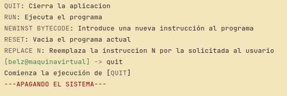
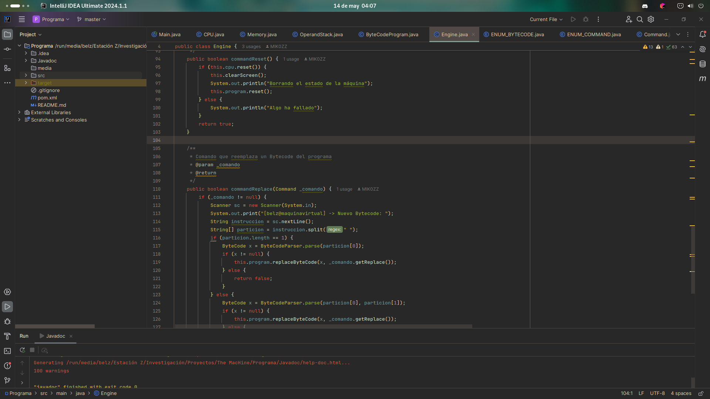

# Descripción

Este programa es una simulación de una máquina virtual donde ejecutas comandos que se almacenan para ejecutarse en orden posteriormente, siendo capaz de modificar los comandos y añadir nuevos cuando al usuario le plazca.

Proyecto del **3º Trimestre** de la asignatura de **Programación**
Profesor: **Jonathan Carrero**
## USO

**help**: Muestra esta ayuda 

**quit**: Cierra el programa

**run**: Ejecuta el programa


**newinst bytecode**: Introduce una nueva instrucción el programa:
	
* **push N**: Almacena un número en la pila
* **add**: Suma los valores
* **sub**: Resta los valores
* **mul**: Multiplica los valores
* **div**: Divide los valores
* **load N**: Carga el valor de la memoria en la posición N
* **store N**: Elimina el valor y lo guarda en la memoria en la posición N de esta
* **out**: Se escribe en la consola "Lo que hay encima de la pila es {numero}"
* **halt**: Detiene el programa, no se ejecutan las siguientes instrucciones

**reset**: Vacía el programa actual

**replace N**: Reemplaza la instrucción N por la solicitada por el usuario

# Dependencias

* jdk22

# Instalación
```bash
git clone https://github.com/MIK0ZZ/theMacHine.git
cd theMacHine
#Abre tu ide aqui
```

# Imágenes

> Terminal del programa


> Código del programa